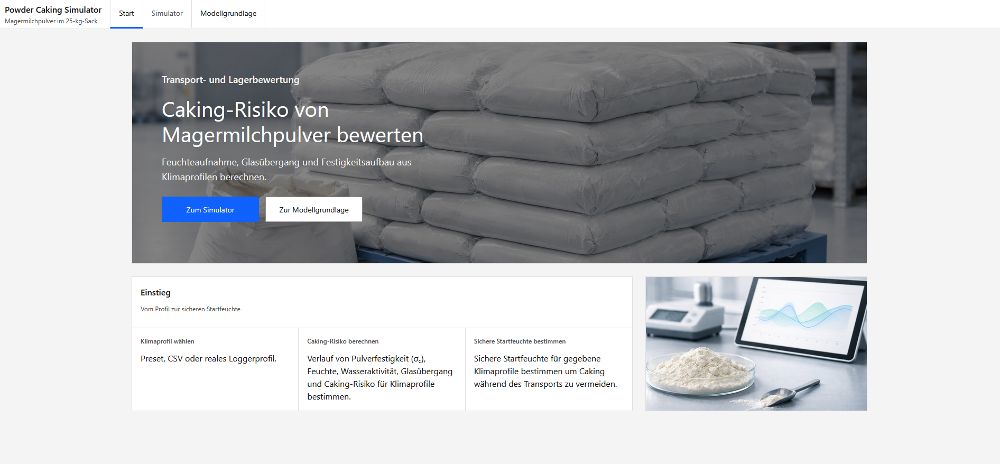
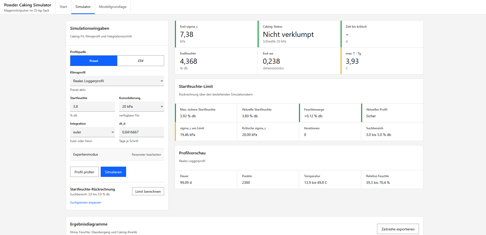
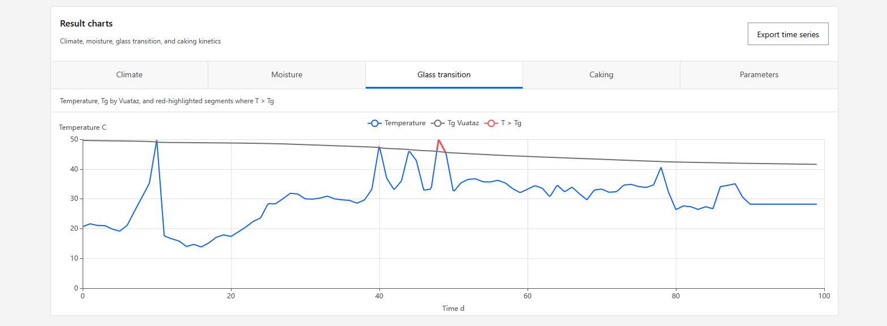

# Powder Caking Simulator

Web app for assessing the caking risk of skim milk powder in a 25 kg bag during transport and storage. The app derives moisture uptake, water activity, glass transition temperature, unconfined yield strength, and the resulting caking risk from climate profiles.

## Features

- Landing page with technical context and direct navigation to the simulator.
- Climate profiles as presets, a measured logger profile, or custom CSV input.
- Profile preview with duration, number of points, temperature range, and relative humidity range.
- Simulation of powder moisture, `aw`, `Tg`, `T - Tg`, caking rate, and unconfined yield strength `σ_c`.
- Result KPIs for final unconfined yield strength, caking status, time to the critical UYS threshold, final moisture, final `aw`, and maximum `T - Tg`.
- Charts for climate, moisture, glass transition, and caking kinetics.
- Back-calculation of the maximum safe initial moisture for a given climate profile.
- Expert mode for model parameters such as GAB, bag data, thresholds, and permeability.
- Model basis page with process chain, equations, and concise notes on the simulation basis.

## App Preview

### Home



### Simulator





## Data Origin

The measurement data and derived tables used in the app were collected and prepared within the AiF 18643 BR research project.

## Requirements

- Git
- Python 3.12 or a compatible Python 3 version
- Node.js and npm
- Optional: Docker and Docker Compose for the simplest local setup

## Quick Start With Docker

Clone the repository and change into the project directory:

```bash
git clone https://github.com/Franky-11/powder-caking-simulator.git
cd powder-caking
```

Build and start the containers:

```bash
docker compose up --build
```

The full app is then available at:

```text
http://localhost:8000
```

Stop containers:

```bash
docker compose stop
```

Stop and remove containers:

```bash
docker compose down
```

## Manual Installation

Clone the repository and change into the project directory:

```bash
git clone https://github.com/Franky-11/powder-caking-simulator.git
cd powder-caking
```

Create a Python environment for the backend and install dependencies:

```bash
python -m venv .venv
source .venv/bin/activate
pip install -r requirements.txt
```

On Windows:

```powershell
python -m venv .venv
.\.venv\Scripts\Activate.ps1
pip install -r requirements.txt
```

Install frontend dependencies and build the frontend:

```bash
cd frontend
npm install
npm run build
cd ..
```

## Run Locally Without Docker

For normal local use, a single server is sufficient. FastAPI serves the built frontend from `frontend/dist/` in addition to the API endpoints.

Start from the repo root:

```bash
source .venv/bin/activate
PYTHONPATH=src uvicorn powder_caking.api:app --host 0.0.0.0 --port 8000
```

On Windows:

```powershell
.\.venv\Scripts\Activate.ps1
$env:PYTHONPATH = "src"
uvicorn powder_caking.api:app --host 0.0.0.0 --port 8000
```

The full app is then available at:

```text
http://localhost:8000
```

React routes fall back to `frontend/dist/index.html`.

## Development Mode With Vite

For UI development, the frontend can still run separately with Vite hot reload.

Start the backend from the repo root:

```bash
source .venv/bin/activate
PYTHONPATH=src uvicorn powder_caking.api:app --reload
```

Start the frontend in a second terminal:

```bash
cd frontend
npm run dev
```

The frontend is then available at:

```text
http://localhost:5173
```

In Vite development mode, the frontend client uses `http://localhost:8000` as its API. For a different backend, set `VITE_API_BASE_URL`.

## Usage

1. Open the app and choose `Open simulator` on the home screen.
2. Select a profile source:
   - `Preset` for predefined climate profiles
   - `CSV` for custom time series
3. Check the initial moisture, consolidation stress, integration method, and time step.
4. Optionally run `Preview profile` to inspect the data range and warnings.
5. Start `Run simulation`.
6. Review result KPIs and charts.
7. Optionally run `Calculate limit` to determine the maximum safe initial moisture for the same profile.
8. Open `Model basis` to inspect the equations, process steps, and reference data.

## CSV Profile

Custom climate profiles can be loaded from a CSV file or pasted as text. Expected columns:

```csv
time_d,temperature_c,relative_humidity_pct
0,25,60
1,28,70
2,30,75
```

`time_d` is time in days. Alternatively, the API can process timestamp-based profiles and convert them to elapsed days.

## Interpreting Results

- `σ_c` describes the calculated unconfined yield strength.
- `σ1` is the consolidation stress used to select the caking fit.
- The critical threshold defaults to `20 kPa`.
- `Not caked` means the calculated unconfined yield strength remains below the critical threshold.
- `Caked` means the critical threshold has been reached or exceeded.
- The initial moisture back-calculation searches for the highest initial moisture that keeps the profile below the critical threshold.

## Tests and Checks

Backend tests:

```bash
source .venv/bin/activate
python -m unittest discover -s tests -v
```

Frontend build and lint:

```bash
cd frontend
npm run build
npm run lint
```

If local Excel raw data is missing, only the Excel-dependent extractor tests are skipped. The app, API, climate, and simulation tests still run.

## Repository Contents

- `src/powder_caking/`: backend, simulation core, API service, and model logic
- `frontend/`: React/Vite/TypeScript frontend
- `data/processed/`: processed CSV data for model parameters, reference data, and climate profiles
- `tests/`: backend, API, climate, simulation, and optional extractor tests
- `scripts/`: helper scripts for data extraction and model parameter fitting
